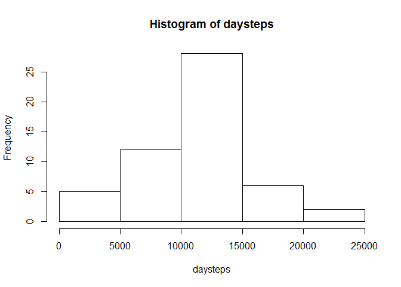
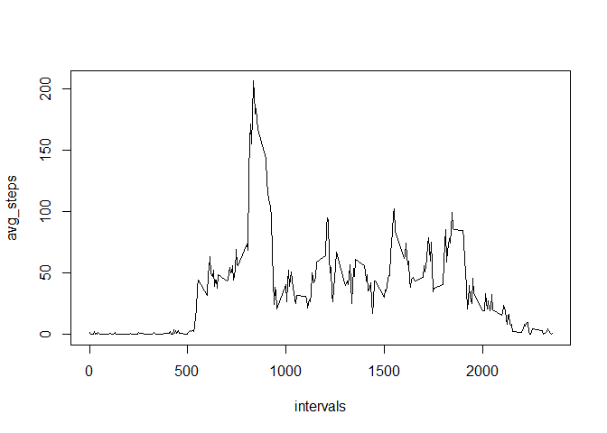
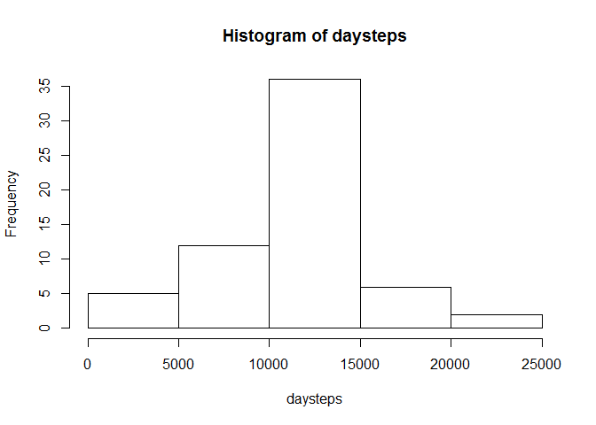
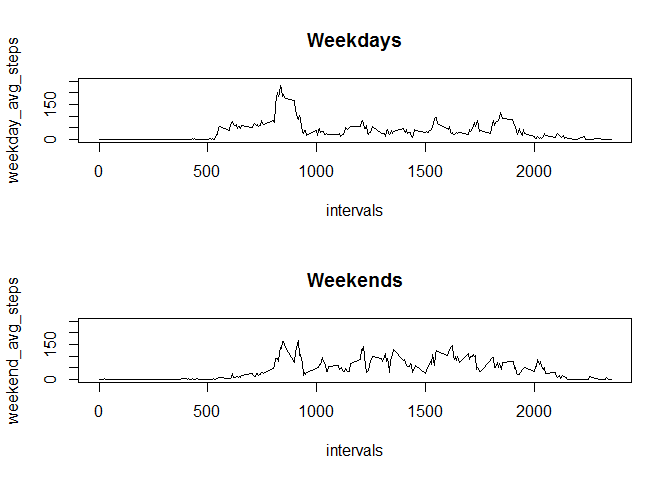

Reproducible Research assignment 1
===========================================================

From the assignment statement: "This assignment makes use of data from a personal activity monitoring device. This device collects data at 5 minute intervals through out the day. The data consists of two months of data from an anonymous individual collected during the months of October and November, 2012 and include the number of steps taken in 5 minute intervals each day."

This assignment involves downloading and anaylizing the data in various ways.

## Load and preprocess the data


```r
# 1. Load the data:
rawdata <- read.csv('activity.csv')

# 2. Process/transform the data (if necessary) into a format suitable for your analysis:
# Keep only those observations with no NAs:
data <- rawdata[complete.cases(rawdata),]
```

## Mean total number of steps taken per day


```r
# Calculate total number of steps taken per day:
days <- unique(data[,2])
daysteps <- 0
i <- 0
for(day in days)
  { 
	i <- i + 1
	daydata <- data[data[,2]==days[i],]
	if(length(daydata[,1])==288){daysteps[i] <- mean(daydata[,1])}else{daysteps[i]<--99}
  }
daysteps
```

```
##  [1]  0.4375000 39.4166667 42.0694444 46.1597222 53.5416667 38.2465278
##  [7] 44.4826389 34.3750000 35.7777778 60.3541667 43.1458333 52.4236111
## [13] 35.2048611 52.3750000 46.7083333 34.9166667 41.0729167 36.0937500
## [19] 30.6284722 46.7361111 30.9652778 29.0104167  8.6527778 23.5347222
## [25] 35.1354167 39.7847222 17.4236111 34.0937500 53.5208333 36.8055556
## [31] 36.7048611 36.2465278 28.9375000 44.7326389 11.1770833 43.7777778
## [37] 37.3784722 25.4722222  0.1423611 18.8923611 49.7881944 52.4652778
## [43] 30.6979167 15.5277778 44.3993056 70.9270833 73.5902778 50.2708333
## [49] 41.0902778 38.7569444 47.3819444 35.3576389 24.4687500
```

```r
hist(daysteps)
```

 

```r
meansteps <- mean(daysteps)
mednsteps <- median(daysteps)
```

In this data set, the average number of steps per day is 37.3825996, and the median number of steps per day is 37.3784722.

## Average daily activity pattern


```r
intervals <- unique(data[,3])
avg_steps <- 0
i <- 0
for(interval in intervals)
	{
	i <- i + 1
	intervaldata <- data[data[,3]==intervals[i],]
	avg_steps[i] <- mean(intervaldata[,1])	
	}
plot(intervals,avg_steps,type="l")
```

 

```r
maxsteps <- max(avg_steps)
maxinterval <- intervals[avg_steps==maxsteps]
maxhr <- floor(maxinterval/60)
maxmin <- (maxinterval/60-maxhr)*60
```
On average, the individual highest activity level (206.1698113 steps) occured during 5-minute interval 835, i.e., 13:55 hrs.

## Imputing missing values

1. Calculate and report the total number of missing values in the dataset (i.e. the total number of rows with NAs)


```r
numNAs = length(rawdata[,1])-length(data[,1])
```
There are 2304 rows with NAs in the raw data.

2. Devise a strategy for filling in all of the missing values in the dataset.

I will replace each NA with the average number of steps across all days in the dataset for that interval.

3. Create a new dataset that is equal to the original dataset but with the missing data filled in.


```r
newdata <- rawdata
for (i in 1:length(newdata[,1]))
	{
	if(is.na(newdata[i,1])){newdata[i,1]=avg_steps[match(newdata[i,3],intervals)]}
	}
```

4.  Make a histogram of the total number of steps taken each day and calculate and report the mean and median total number of steps taken per day.


```r
# Calculate total number of steps taken per day:
days <- unique(newdata[,2])
daysteps <- 0
i <- 0
for(day in days)
  { 
	i <- i + 1
	daydata <- newdata[newdata[,2]==days[i],]
	if(length(daydata[,1])==288){daysteps[i] <- mean(daydata[,1])}else{daysteps[i]<--99}
  }
daysteps
```

```
##  [1] 37.3825996  0.4375000 39.4166667 42.0694444 46.1597222 53.5416667
##  [7] 38.2465278 37.3825996 44.4826389 34.3750000 35.7777778 60.3541667
## [13] 43.1458333 52.4236111 35.2048611 52.3750000 46.7083333 34.9166667
## [19] 41.0729167 36.0937500 30.6284722 46.7361111 30.9652778 29.0104167
## [25]  8.6527778 23.5347222 35.1354167 39.7847222 17.4236111 34.0937500
## [31] 53.5208333 37.3825996 36.8055556 36.7048611 37.3825996 36.2465278
## [37] 28.9375000 44.7326389 11.1770833 37.3825996 37.3825996 43.7777778
## [43] 37.3784722 25.4722222 37.3825996  0.1423611 18.8923611 49.7881944
## [49] 52.4652778 30.6979167 15.5277778 44.3993056 70.9270833 73.5902778
## [55] 50.2708333 41.0902778 38.7569444 47.3819444 35.3576389 24.4687500
## [61] 37.3825996
```

```r
hist(daysteps)
```

 

```r
meansteps <- mean(daysteps)
mednsteps <- median(daysteps)
```
In this data set, *now will missing values imputed by substituting the average number of steps taken during the associted 5-minute interval across all days containing data*, the average number of steps per day is 37.3825996, and the median number of steps per day is 37.3825996. Notice that now the mean and median are equal, whereas they were not exactly equal before we imputed the missing data.

## Are there differences in activity patterns between weekdays and weekends?


```r
for(i in 1:length(newdata[,1]))
	{
	newdata[i,4] <- weekdays(as.Date(newdata[i,2]))
	if(newdata[i,4]=="Saturday"|newdata[i,4]=="Sunday"){newdata[i,5]<-"weekend"}else{newdata[i,5]<-"weekday"}
	}
newvar <- factor(newdata[,5])
newdata[,6] <- newvar
newdata <- newdata[-c(4:5)]
```

2. Make a panel plot containing a time series plot of the 50minute interval (x-axis) and the average number of steps taken, averaged across all weekday days or weekend days (y-axis).


```r
library(lattice)
```

```
## Warning: package 'lattice' was built under R version 3.1.3
```

```r
intervals <- unique(newdata[,3])
weekday_data <- newdata[which(newdata[,4]=="weekday"),]
weekend_data <- newdata[which(newdata[,4]=="weekend"),]
weekday_avg_steps <- 0
weekend_avg_steps <- 0
i <- 0
for(interval in intervals)
	{
	i <- i + 1
	weekday_intervaldata <- weekday_data[weekday_data[,3]==intervals[i],]
	weekday_avg_steps[i] <- mean(weekday_intervaldata[,1])
	weekend_intervaldata <- weekend_data[weekend_data[,3]==intervals[i],]
	weekend_avg_steps[i] <- mean(weekend_intervaldata[,1])
	}

par(mfrow = c(2,1))
plot(intervals,weekday_avg_steps,type="l",ylim=c(0,250))
title(main = "Weekdays",font=2)
plot(intervals,weekend_avg_steps,type="l",ylim=c(0,250))
title(main = "Weekends",font=2)
```

 

The above plots are not pretty (still an R newbie), but they show time series lines plots of the average steps taken per 5-minute interval for all weekdays and weekends, respectively, in the dataset with missing values imputed.

